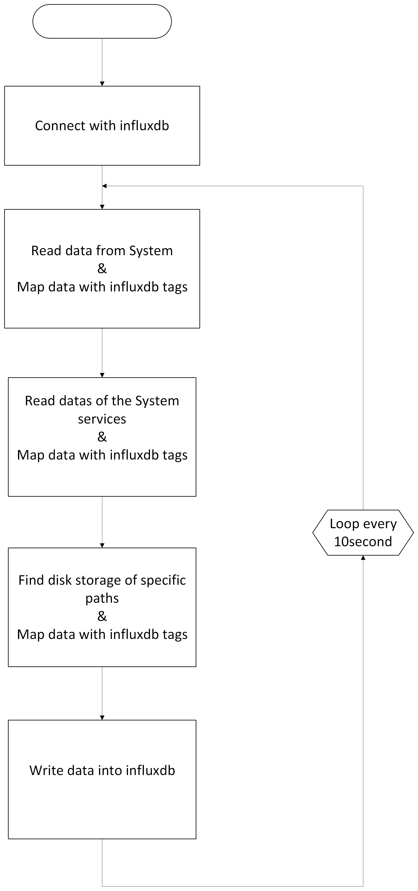

# System Metrics
## About the Project
System-metrics is used to collect and monitor system utilization details.
It has 3 level of monitoring:
-- System level
Used to collect system level details like ram usage, cpu usage, disk usage etc.
-- Service level
Used to monitor services in the system, like memory usage of the service
-- Storage level 
Used to monitor the storage of specific paths

All this details will be stored into influxdb database,  

<figure>

</figure>